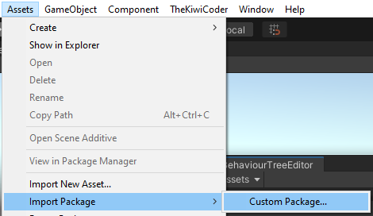
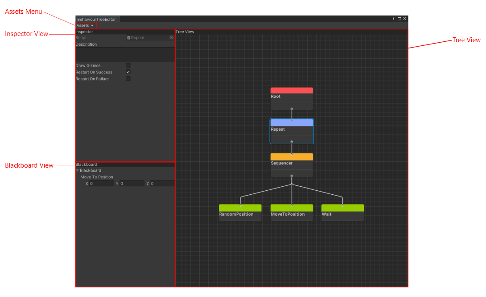
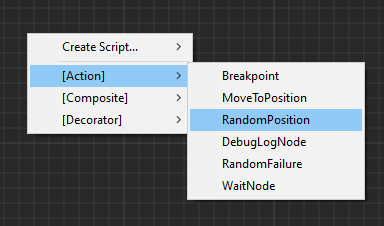
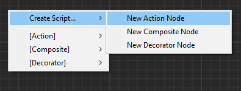
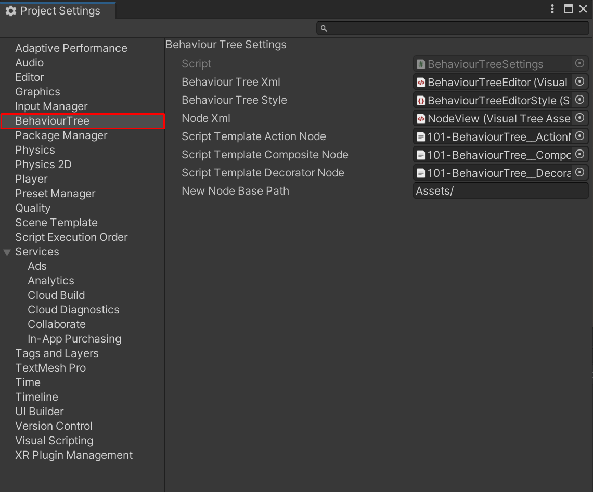

<div align="center" valign="middle" style="page-break-after: always;">
<br>
<br>
<br>
<br>
<br>
<br>
<br>
<br>
    <h1>Behaviour Tree Editor</h1>
    
    <br>
    Created by TheKiwiCoder
</div>

## Table of Contents
1. [Overview](#overview)
2. [Getting Started](#getting-started)
3. [Nodes](#nodes)
    1. [Action Nodes](#action-nodes)
    2. [Composite Nodes](#composite-nodes)
    3. [Decorator Nodes](#decorator-nodes)
6. [The Editor](#the-editor)
    1. [TreeView](#tree-view)
        1. [Adding Nodes](#adding-nodes)
        2. [Creating New Nodes](#creating-new-nodes)
        3. [Linking Nodes](#linking-nodes)
        4. [Navigation](#navigation)
    2. [Inspector View](#inspector-view)
    3. [Blackboard View](#blackboard-view)
    4. [Assets Menu](#assets-menu)
7. [Runtime Debugging](#runtime-debugging)
8. [Settings](#settings-menu)

<div style="page-break-after: always;"></div>

## Overview

Behaviour trees are great at creating both simple and complex ai behaviours. One of the main advantages of behaviour trees is their ability to breakdown complex behaviours into very simple units called Actions, which can rearranged in various ways to create new behaviours. 

This concept combined with a custom editor in Unity provides a powerful toolset to prototype out new ideas quickly, without having to worry about code organisation.

## Getting Started

To install the editor into your project, import the package contained in the zip file into your Unity project from the assets menu: ```Assets->Import Package->Custom Package```



All files will be installed to `Assets/TheKiwiCoder/BehaviourTree`

An example scene and behaviour tree can be found at `Assets/TheKiwiCoder/BehaviourTree/Example`

> **_NOTE:_**  The version used for testing at time of writing is Unity 2020.3.13f1 LTS.

## Nodes

A behaviour tree starts execution from the root node traversing down into it's children. Each node in the tree can return one of three states; failure, success, or running. It is up to the parent node to decide how to interpret these return states, and decide what to do next if a failure occurs. Generally, the tree traversal stops for the current frame when one of the children returns the running state, in which case the recursion bubbles back up to the root. 

There are three main types of nodes in a behaviour tree: ```Action```, ```Composite```, and  ```Decorator```.

## Action Nodes
Action nodes make up the bulk of the tree. They are always at the leaf of the tree, and have no children. These nodes are responsible for changing the state of the world, and ultimately represent the agent's capabilities. An agents capabilities should be represented as actions (e.g reload weapon, walk to position, wave). You will create many new types of actions to represent what the agents can do in your game.

The granularity of actions can either be large or small, but it's often a good idea to keep the actions as small as possible to increase reuse across the tree. Once you have built a decent library of actions for your AI they can be composed together to create complex behaviours. When patterns start occuring between commonly used nodes, the nodes can be merged back into a single node to reduce the clutter in the tree.

Some sample action node types included in the package are:

- Log - Logs a message to the console
- Wait - Waits for a period of time
- Breakpoint - Pauses the editor when executed
- RandomFailure - Returns failure to it's parent with a random chance value between 0 and 1
- RandomPosition - Generates a random position within a min/max range and assigns the value to the blackboard.
- MoveToPosition - Reads a position from the blackboard, and sets the navmesh agent destination to this position.

## Composite Nodes

Composite nodes represent the control flow of the tree, and can have many children. It's up to each composite node type to decide which order the children should be executed in. Composite nodes also monitor the failure state of it's children. There are many ways to handle failures and execution order, and this is what differentiates each composite node from another. The two most common composite node types are sequencer and selector (a.k.a fallback), however many other composite node types are usually necessary to create complex logic. One example is the parallel node which is capable of executing multiple children at once.

The sequencer node executes it's children from left to right, stopping when one of the children returns failure, in which case it will stop also and return failure back to it's parent. This is most useful for executing a sequence of actions in order. If any of the children fail the entire sequence will stop.

A selector is the opposite of a sequencer. Instead it will continue executing each children, and stop when a child that returns success. This is useful if there are a sequence of actions that can fail and require a backup plan. For example, an agent may first try to look for cover, and if there is none in sight then it will might attempt to run instead.

The composite node types included in the package are:

|Node Type|Execution Order|Success|Failure|
---| --- | --- | --- |
| Sequencer | Executes children one at a time left to right | When all children return success | When one child returns failure
| Selector | Executes children one at a time left to right | When one child returns success | When all children return failure
| Random Selector | Randomly selects one child to execute (:O) | When the child returns success | When the child returns failure
| Parallel | Executes all children 'at once' concurrently. Multiple children can be in the running state at the same time. | When all children return success | When one child returns failure. Remaining running children are aborted.
| Interrupt Selector | Similar to Selector, but children are constantly reevaluated each tick. If a child with higher priority succeeds, the current running child is aborted and control is given to the new child. | When one child returns success | When all children return failure

## Decorator Nodes

Decorator nodes have exactly one child, and are used to hide or modify the return state of it's child. A common decorator node is the inverter which negates the childs return status. However they are also able to have complex logic inside them such as restarting a child when it returns failure X number of times, or aborting a child that has been running for too long.

The Decorator node types included in the package are:

- Failure - Always returns failure to the parent
- Succeed - Always returns success to the parent
- Inverter - Inverts the childs return state from success to failure and vice versa
- Repeat - Restarts the child on failure and/or success.
- Timeout - Aborts a child that has been running for too long.

<div style="page-break-after: always;"></div>

## The Editor

The main window can be accessed via the menu ```TheKiwiCoder->BehaviourTreeEditor...```


The editor has three main panels, ```Inspector```, ```Blackboard```, and ```TreeView``` in addition to the ```Assets``` Menu.



The first time opening up the behaviour tree editor a prompt will appear to create a new behaviour tree. Pick a name
for the tree and select a location, then press Create.


### Tree View

The tree view is where you'll spend most of the time creating and organising nodes.

#### Adding Nodes

New nodes can be added to the tree via the context menu by right clicking anywhere in the canvas and selecting which type of node to add. The nodes are grouped into three sub menus, Actions, Composites, and Decorators.



#### Creating New Nodes

The built in node types will only get you so far. The real power of behaviour trees comes when you design and create your own node types. Nodes are standard C# scripts which inherit from one of three base types, `ActionNode`, `CompositeNode`, or `DecoratorNode`. These scripts can be created by hand, or by using the context menu which will fill out the boilerplate automatically for you.



The script templates used to create the boilerplate are located here: `Assets/TheKiwiCoder/BehaviourTree/ScriptTemplates`

#### Linking Nodes

To add a node as a child of another node, drag the `output` of the parent node to the `input` of the child node. Note only `CompositeNode` types can have multiple children. 

#### Navigation

Nodes can be selected directly and dragged around the canvas. Multiple nodes can be box selected. 

To select and entire `subtree`, double click on it's parent and the children will be added to the selection. Click on the canvas to deselect again. Selecting entire subtrees is really useful to reorganise the tree layout.

Keyboard Shortcuts:

|KeyCode|Action|
---| --- |
DEL | Deletes the currently selected nodes |
A | Frames all nodes on the canvas |
O | Frames the canvas origin |
[ | Frames the parent node of the current selection |
] | Frames the child node of the current selection |


### Inspector View

The inspector view displays all public properties of the currently selected node. To display a node's properties in the inspector, be sure to select the middle of the node over the node's title. All nodes have a description field which can be set in the inspector. Just start typing in the description box and the text will appear under the node's title.


### Blackboard View

The blackboard view displays all public properties of the blackboard. These values can be read and written to by individual nodes from any level of the tree. Note this blackboard is not generic, and it is expected to be modified to include the properties that make sense for your game. An example property exists as an example how data can be passed between nodes.
- MoveToPosition - Vector3 written to by the `RandomPosition` node, and read from by the `MoveToPosition` node

### Assets Menu

The assets menu dropdown shows all behaviour trees located in the project. Use this to quickly jump between different trees in your project. There is an additional menu option to create a new behaviour tree from here too.

### Runtime Debugging

While in playmode, a game object can be selected to analyse which state it's in. Nodes that are red have failed, nodes that a green have succeeded, and nodes that are yellow are currently running. If a node is aborted then it returns to the default state without any highlight.

### Settings Menu

There are various 'hardcoded' settings for the behaviour tree editor. These can be accessed via the standard project settings menu under the 'Behaviour Tree' category.


