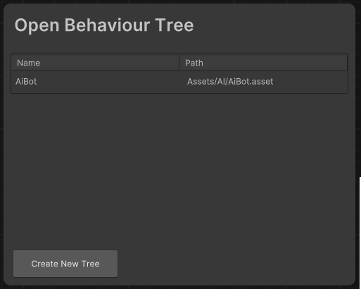
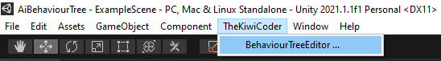
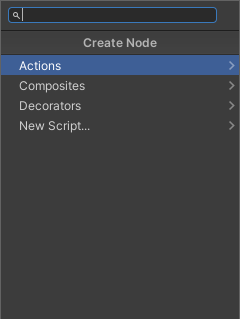
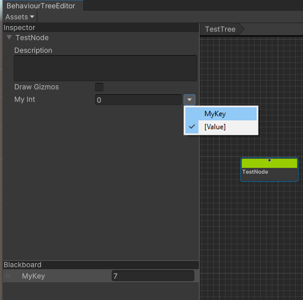

<div align="center" valign="middle" style="page-break-after: always;">
<br>
<br>
<br>
<br>
<br>
<br>
<br>
<br>
    <h1>Behaviour Tree Editor</h1>
    
    <br>
    Created by TheKiwiCoder
</div>

## Table of Contents
1. [Overview](#overview)
    1. [Requirements](#requirements)
    2. [Installation](#installation)
2. [Getting Started](#getting-started)
4. [Nodes](#nodes)
    1. [Action Nodes](#action-nodes)
    2. [Composite Nodes](#composite-nodes)
    3. [Decorator Nodes](#decorator-nodes)
5. [The Editor](#the-editor)
    1. [TreeView](#tree-view)
        1. [Adding Nodes](#adding-nodes)
        2. [Creating New Nodes](#creating-new-nodes)
        3. [Linking Nodes](#linking-nodes)
        4. [Navigation](#navigation)
    2. [Inspector View](#inspector-view)
    3. [Blackboard View](#blackboard-view)
    4. [Assets Menu](#assets-menu)
6. [Runtime Debugging](#runtime-debugging)
7. [Settings](#settings-menu)

<div style="page-break-after: always;"></div>

## Overview

This repository contains a Unity Package which can be installed from package manager. 


## Installation 

The minimum version currently supported is Unity 2023.2

To install the BehaviourTreeEditor, run the `Add Package From git URL` command from PackageManager inside Unity and paste in the following URL:

```
https://github.com/thekiwicoder0/UnityBehaviourTreeEditor.git
```

See https://docs.unity3d.com/Manual/upm-ui-actions.html for more options on installing packages.

Note: If you receive the error `No 'git' executable was found` you're likely missing a git installation. You can install git from here: https://git-scm.com/download/win

## Getting Started

The first time opening up the behaviour tree editor a prompt will appear where you can either select an existing tree to open, or create a new one:



Either select an existing tree using the dropdown, or create a new tree at the path specified.

## Nodes

A behaviour tree starts execution from the root node traversing down into it's children. Each node in the tree can return one of three states; failure, success, or running. It is up to the parent node to decide how to interpret these return states, and decide what to do next if a failure occurs. Generally, the tree traversal stops for the current frame when one of the children returns the running state, in which case the recursion bubbles back up to the root. 

There are three main types of nodes in a behaviour tree: ```Action```, ```Composite```, and  ```Decorator```.

## Action Nodes
Action nodes make up the bulk of the tree. They are always at the leaf of the tree, and have no children. These nodes are responsible for changing the state of the world, and ultimately represent the agent's capabilities. An agents capabilities should be represented as actions (e.g reload weapon, walk to position, wave). You will create many new types of actions to represent what the agents can do in your game.

The granularity of actions can either be large or small, but it's often a good idea to keep the actions as small as possible to increase reuse across the tree. Once you have built a decent library of actions for your AI they can be composed together to create complex behaviours. When patterns start occuring between commonly used nodes, the nodes can be merged back into a single node to reduce the clutter in the tree.

Some sample action node types included in the package are:

- Log - Logs a message to the console
- Wait - Waits for a period of time
- Breakpoint - Pauses the editor when executed
- RandomFailure - Returns failure to it's parent with a random chance value between 0 and 1
- RandomPosition - Generates a random position within a min/max range and assigns the value to the blackboard
- MoveToPosition - Reads a position from the blackboard, and sets the navmesh agent destination to this position
- SetProperty - Sets a blackboard key to the value specified in the node inspector
- CompareProperty - Compares a blackboard key to the value specified in the node inspector
- SubTree - Executes another behaviour tree as a subtree of this node

## Composite Nodes

Composite nodes represent the control flow of the tree, and can have many children. It's up to each composite node type to decide which order the children should be executed in. Composite nodes also monitor the failure state of it's children. There are many ways to handle failures and execution order, and this is what differentiates each composite node from another. The two most common composite node types are sequencer and selector (a.k.a fallback), however many other composite node types are usually necessary to create complex logic. One example is the parallel node which is capable of executing multiple children at once.

The sequencer node executes it's children from left to right, stopping when one of the children returns failure, in which case it will stop also and return failure back to it's parent. This is most useful for executing a sequence of actions in order. If any of the children fail the entire sequence will stop.

A selector is the opposite of a sequencer. Instead it will continue executing each children, and stop when a child that returns success. This is useful if there are a sequence of actions that can fail and require a backup plan. For example, an agent may first try to look for cover, and if there is none in sight then it will might attempt to run instead.

The composite node types included in the package are:

|Node Type|Execution Order|Success|Failure|
---| --- | --- | --- |
| Sequencer | Ticks children left to right until a child returns failure. | When all children return success | When one child returns failure
| Selector | Ticks children left to right until a child returns success. | When one child returns success | When all children return failure
| Parallel | Ticks all children until M children return success. | When M children return success | When (N-M)+1 children return failure

## Decorator Nodes

Decorator nodes have exactly one child, and are used to hide or modify the return state of it's child. A common decorator node is the inverter which negates the childs return status. However they are also able to have complex logic inside them such as restarting a child when it returns failure X number of times, or aborting a child that has been running for too long.

The Decorator node types included in the package are:

- Failure - Always returns failure to the parent
- Succeed - Always returns success to the parent
- Inverter - Inverts the childs return state from success to failure and vice versa
- Repeat - Restarts the child on failure and/or success.
- Timeout - Aborts a child that has been running for too long.

<div style="page-break-after: always;"></div>

## The Editor

The main window can be accessed via the menu ```Window->AI->BehaviourTree...```



The editor has three main panels, ```Inspector```, ```Blackboard```, and ```TreeView``` in addition to the ```Assets``` Menu.


## Tree View

The tree view is where you'll spend most of the time creating and organising nodes.

### Adding Nodes

New nodes can be added to the tree via the context menu by right clicking on the canvas and selecting which type of node to add. The nodes are grouped into three sub menus, Actions, Composites, and Decorators. You can start typing immediately to filter nodes by name



### Creating New Node Script

The real power of behaviour trees comes when you design and create your own node types. Nodes are standard C# scripts which inherit from one of three base types, `ActionNode`, `CompositeNode`, or `DecoratorNode`. These scripts can be created by hand, or by using the context menu which will generate a new script from a template for you.


The script templates used to create the boilerplate are located here: `Assets/TheKiwiCoder/BehaviourTree/ScriptTemplates`

### Linking Nodes

To add a node as a child of another node, drag the `output` of the parent node to the `input` of the child node. Note only `CompositeNode` types can have multiple children. 

### Navigation

Nodes can be selected directly and dragged around the canvas. Multiple nodes can be box selected. 

To select and entire `subtree`, double click on it's parent and the children will be added to the selection. Click on the canvas to deselect again. Selecting entire subtrees is really useful to reorganise the tree layout.

Keyboard Shortcuts:

|KeyCode|Action|
---| --- |
DEL | Deletes the currently selected nodes |
A | Frames all nodes on the canvas |
O | Frames the canvas origin |
[ | Frames the parent node of the current selection |
] | Frames the child node of the current selection |
CTRL | Selects the sub hierarchy of this node |
CTRL + D | Duplicates the selected nodes |
CTRL + C | Copys the selected nodes |
CTRL + V | Pastes the selected nodes (must deselect first) |
Left Click | Select Node |
Right Click | Create Node Context menu |

### Node Inspector View

The NodeInspector view displays all public properties of the currently selected node. To display a node's properties in the inspector, be sure to select the middle of the node over the node's title. All nodes have a description field which can be set in the inspector. Just start typing in the description box and the text will appear under the node's title.


## Blackboard View

The BlackboardView contains a list of keys that Nodes can read and write to. This lets nodes pass data between each other from anywhere in the behaviour tree. 

Example: A `FindCover` action scans the environment looking for a position to safely retreat to and writes the result to the blackboard. A second `MoveTo` action then reads that position from the blackboard and moves to it.  

Blackboard Keys can be added in the blackboard view by entering a unique name into the `Name` field, and selecting the type of key to create from the `Type` dropdown. Each key within the blackboard must have a unique name:


Keys can be deleted by rightclicking on the node's value and selecting delete.

### Declaring a new BlackboardKey type

All common unity types are built into the blackboard already, but if you have a custom type your project uses that you'd like to store in the blackboard it's very easy to register it. The blackboard looks at all classes that subclass the BlackboardKey<T> type, and uses that list to populate the `Type` dropdown in the BlackboardView.

To register a new type, create a class that inherits from BlackboardKey<T> somewhere in your project:

```
[System.Serializable]
public class MyTypeKey : BlackboardKey<MyType> {

}
```

That's it! The Editor uses PropertyDrawers to render the inspector view for your type. If you've defined a custom property drawer then it will show up as you'd expect.

### The NodeProperty<T> Class

The NodeProperty<T> class makes it extremely simple to write values to the blackboard from Nodes.

To read/write a blackboard key from a node, Add a public `NodeProperty<T>` variable to your node, and use the `Value` property to read and write:

```
[System.Serializable]
public class TestNode : ActionNode
{
    public NodeProperty<int> myInt;

    ...

    protected override State OnUpdate() {
        int value = myInt.Value;
        Debug.Log("Value:" = value);
        myInt.Value = value + 1;
        return State.Success;
    }
}
```

Then select the blackboard key from dropdown in the NodeInspector:



It is also possible to set a fixed default value by selecting the `[Value]` from the dropdown. This value can be set directly on the node instead of using a BlackboardKey. This keeps things flexible when adding parameters to your actions as it allows you to decide later if that value should be stored directly on the node or in the blackboard.

### Read and Write to the blackboard from a Monobehaviour

Firstly, it's important to note that values must be written to the blackboard <i>instance</i> the GameObject is executing at runtime, rather than the behaviour tree asset. To do this, store a reference to the `BehaviourTreeInstance` you want to write to. Then use the `SetBlackboardValue<T>` and `GetBlackboardValue<T>` methods on `BehaviourTreeInstance`. Keys can be cached ahead of time to avoid lookups each time if reading/writing values in a tight loop.

```
public class BlackboardController : MonoBehaviour
{
    public BehaviourTreeInstance behaviourTreeInstance; // Assign in the inspector

    BlackboardKey<int> keyReference; // Cache the key reference to avoid lookups each frame

    void Start()
    {
        // Simple version. Finds the key on each call to Get/Set
        int value = behaviourTreeInstance.GetBlackboardValue<int>("MyInt");
        behaviourTreeInstance.SetBlackboardValue("MyInt", value + 42);

        // Cached version, find the key and store a reference to it.
        keyReference = behaviourTreeInstance.FindBlackboardKey<int>("MyInt");
    }

    void Update()
    {
        // Avoids key lookup each frame.
        keyReference.value += 42;
    }
}
```

## BlackboardKey Overrides

Sometimes you want to override blackboard keys values for a specific game object. For example, you may have the agent's speed stored in a blackboard key, and want to create a fast and slow variant of the agent.

BlackboardKey overrides allows specific key values to be override when the game object starts. 

To add an override, select the GameObject with a BehaviourTreeInstance component, and add a new override. Select the key from the dropdown and enter a value into the property field:


### Assets Menu

The assets menu dropdown shows all behaviour trees located in the project. Use this to quickly jump between different trees in your project. There is an additional menu option to create a new behaviour tree from here too.

### Runtime Debugging

While in playmode, a game object can be selected to analyse which state it's in. Nodes that are red have failed, nodes that a green have succeeded, and nodes that are yellow are currently running. If a node is aborted then it returns to the default state without any highlight.

### Settings Menu

There are various settings for the behaviour tree editor. These can be accessed via the standard project settings menu under the 'Behaviour Tree' category.


### References

1. Michele Colledanchise and Petter ¨Ogren, Behavior Trees in Robotics and AI. https://arxiv.org/pdf/1709.00084